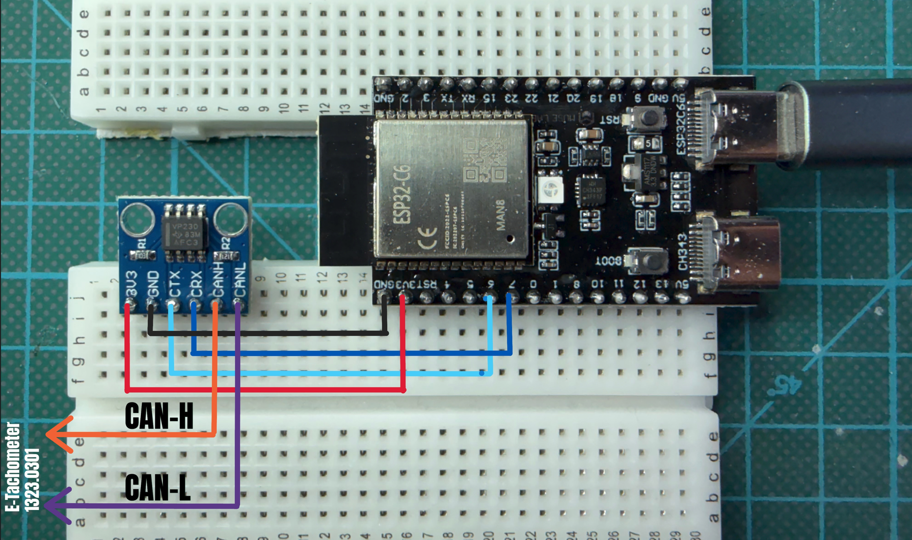

# Pinout & Hardware Setup

### [Deutsche Version](PINOUT.de.md)

## This overview describes the physical connection for the **Komsi2Tacho** project.

<p align="left">
  
</p>

## 1. ESP32-C6 to CAN-Transceiver (SN65HVD230)

| Signal  | ESP32-C6 Pin       | Transceiver Pin | Note                 |
|:--------|:-------------------|:----------------|:---------------------|
| **TX**  | `GPIO 6` (TWAI_TX) | `CTX`           | Data from ESP to bus |
| **RX**  | `GPIO 7` (TWAI_RX) | `CRX`           | Data from bus to ESP |
| **VCC** | `3V3`              | `3V3`           | 3.3V power supply    |
| **GND** | `GND`              | `GND`           | Common ground        |

## 2. Connection VDO MTCO 1323.0301 (Speedometer)

The speedometer uses standardized ISO connectors (A, B, C, D) on the back; only connector A is used.

*Attention: The speedometer requires **24V** DC!*

| Pin | Signal       | Connection          |
|:----|:-------------|:--------------------|
| A1  | Constant +   | +24V power supply   |
| A2  | Illumination | +24V power supply   |
| A3  | Ignition     | +24V power supply   |
| A4  | CAN-High     | Transceiver `CAN-H` |
| A5  | -            | -                   |
| A6  | GND          | Power supply ground |
| A7  | CAN-GND      | - not connected -   |
| A8  | CAN-Low      | Transceiver `CAN-L` |

A1/A2/A3 are connected to 24V of the power supply and A6 is connected to ground/minus of the power supply.

## 3. USB Connection ESP32-C6 to PC

The `nanoESP32‑C6 V1.0 development board` has two USB ports, onle the "native" Port is used.

| USB    | Label on board | Function                                          | Note          |
|:-------|:---------------|:--------------------------------------------------|:--------------|
| Native | `ESP32C6`      | Integrated into ESP32C6, JTAG debugging, flashing | Connect to PC |
| CH343  | `CH343`        | USB-to-Serial connection (UART)                   | - unused -    |

If you connect a terminal program to the USB, a Komsi message should be output on the KOMSI port and you can send
commands to the ESP32-C6 manually.

## 4. Debug Mode (Self-test)

If **GPIO 10** is connected to GND during startup (either via power-on or by pressing the reset button), the software enters a **CAN bus self-test mode** and remains in this mode until the next reset.

In this mode, the communication between the ESP32 and the CAN transceiver is tested every second. The ESP32 sends a data packet to the transceiver and verifies its reception. **For this test, no other CAN bus participants should be connected to the transceiver.**

When the test begins, a message will appear on the serial console indicating that the test has started. Following this, the test results will be output every 1 second.


  ```
11:06:25.256 -> ========================================
11:06:25.256 -> Komsi2Tacho Version 1.8.0-alpha started
11:06:25.256 -> --- CAN-Bus Self-Test Mode ---
11:06:25.256 -> Selbsttest erfolgreich: Paket korrekt empfangen
11:06:26.265 -> Selbsttest erfolgreich: Paket korrekt empfangen
11:06:27.241 -> Selbsttest erfolgreich: Paket korrekt empfangen
11:06:28.258 -> Selbsttest erfolgreich: Paket korrekt empfangen
11:06:29.242 -> Selbsttest erfolgreich: Paket korrekt empfangen
11:06:30.252 -> Selbsttest erfolgreich: Paket korrekt empfangen
  ```

## Important Notes

- **Termination:** Approximately 60 ohms should be measured between CAN-H and CAN-L. Inexpensive transceivers already
  have an internal resistor of 120 ohms. If a resistance of 120 ohms is measured between CAN-H and CAN-L, an additional
  120 ohm resistor should be connected between the two lines (parallel connection). After that, 60 ohms should be
  measured between CAN-H and CAN-L.
- **Common Ground:** Connect the `GND` of the ESP32 to the `CAN-GND` ground of the speedometer/power supply only if
  there are signal errors. Normally, this is not necessary in this use case.
- **ESP32 Power Supply:** The ESP32 receives its power supply via the USB connection from the PC.
- **ESP32 Type:** There are many different variants of the ESP32. This project uses the `ESP32-C6` and would need to be
  significantly adapted for other variants.
- Currently used board: `nanoESP32‑C6 V1.0 development board`
- Currently used CAN bus transceiver: `SN65HVD230`. It is important that it is the VP230 type; others may not reliably
  enough reach the necessary voltages of the CAN bus with the 3.3 volt supply voltage of the ESP32.
