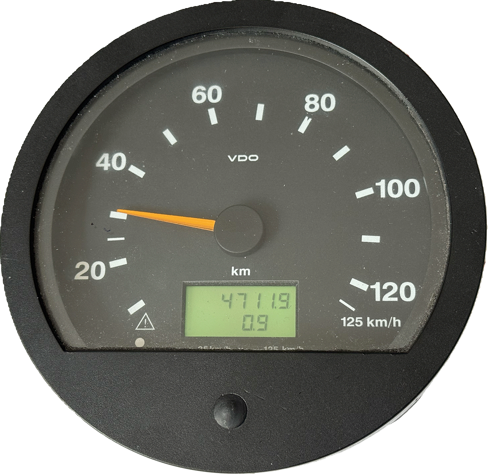

# Komsi2Tacho

### [English version](README.md)

## Dieses Projekt ermöglicht die Ansteuerung eines physischen **VDO MTCO 1323** (Tacho / Geschwindigkeitsanzeige) (bekannt aus Linienbussen) direkt aus einer Simulation heraus.

  

**Die Kommunikation basiert auf dem [KOMSI-Protokoll](https://github.com/thatzok/Komsi-Protocol) via USB/Serial und der Ausgabe der Daten über den CAN-Bus**.

Gegenüber dem VDO TCO 1323 (Tacho-Anzeige, "Speedometer") tun wir auf dem CAN-BUS so, als wären wir ein VDO MTCO 1324 (Fahrtenschreiber, "Tachograph").

## Projektbeschreibung

`Komsi2Tacho` fungiert als Übersetzer zwischen Simulations-Software am PC und realer Hardware. Es liest
Telemetriedaten (insbesondere Geschwindigkeit) ein, transformiert diese in die entsprechenden CAN-Frames, die vom
MTCO-Tachographen verarbeitet werden können und kümmert sich darum die CAN-Daten regelmäßig in den notwendigen
Zeitintervallen zu senden.

## Features

- Direkte Umsetzung von KOMSI-Daten in CAN-Bus Nachrichten.
- Optimiert für geringe Latenz zwischen Simulation und Zeigerausschlag.
- Speziell angepasst an die spezifischen CAN-Parameter des VDO MTCO 1323.

## Voraussetzungen

- Ein Mikrocontroller (**ESP32C6**) und ein CAN-BUS-Transceiver (**VP230**).
- Ein VDO **MTCO 1323** mit CAN-BUS (die ganz alten mit eingebautem Fahrtenschreiber haben keinen CAN-BUS)
- Da der MTCO 1323 mit 24V betrieben wird, ist ein 24V-Netzteil notwendig
- Eine Simulation oder ein Plugin, welches das [KOMSI-Protokoll](https://github.com/thatzok/Komsi-Protocol) über die serielle Schnittstelle ausgibt (
  z.B. **TheBus2Komsi** oder **Omsi2Komsi**). Zum Testen kann man sich aber auch mit einem Terminalprogramm mit
  dem USB-Anschluss verbinden und manuell Befehle einzugeben.

## Download & Installation

1. Gehe zur Seite des [neuesten Releases](https://github.com/thatzok/Komsi2Tacho/releases).
2. Lade die Datei `komsi2tacho_vx.x.x.zip` herunter.
3. Entpacke den Inhalt der ZIP-Datei in einen Ordner deiner Wahl.
4. Installiere das Offizielle-Tool "**espflash**", falls noch nicht installiert
5. Verbinde beide USB-Anschlüsse (siehe [PINOUT.de.md](PINOUT.de.md)) des **ESP32C6** mit dem PC
6. flashe die .bin-datei mit: `espflash flash komsi2tacho_esp32c6.bin` 
7. falls das flashen probleme macht, erzwinge das board mit:  `espflash flash --chip esp32c6 komsi2tacho_esp32c6.bin`
8. Verbinde den esp32c6 mit dem Tacho (CAN-High / CAN-Low) und achte auf die korrekte Terminierung (60 Ohm gesamt).

## Falls Flashen nicht startet: Bootloader/Download‑Mode

Manche Boards gehen automatisch in den Flash‑Mode, manche nicht. Dann:

BOOT gedrückt halten
EN/RESET kurz drücken
BOOT loslassen
Danach nochmal flashen.

## Nutzung

1. Verbinde den esp32c6 mit dem Tacho (CAN-High / CAN-Low) und achte auf die korrekte Terminierung (60 Ohm gesamt).
2. Verbinde einen oder beide USB-Anschlüsse (siehe [PINOUT.de.md](PINOUT.de.md)) des **ESP32C6** mit dem PC

## Disclaimer

Dieses Projekt dient ausschließlich Simulationszwecken im privaten Bereich. Eine Verwendung im realen Straßenverkehr zur
Manipulation von Kontrollgeräten ist strikt untersagt.

Dieses Projekt ist ohne irgendwelche Gewährleistung oder Garantie. Du benutzt es komplett auf eigene Gefahr.
Ich bin nicht dafür verantwortlich, falls Du einen Kurzschluss machst oder PC, ESP, Netzteil, Tacho oder sonstwas
damit kaputt machst.

**Have Fun!**

